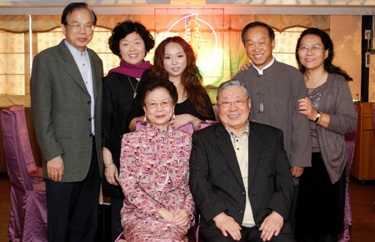

<!--追思許哥哥--!>

　　李殿魁教授是許學仁教授的恩師，因此我稱呼他為許哥哥(按輩分應為師哥)。他是看著我及我雙胞姐姐從小長大的。除了家人之外，他幾乎就像親人一般，時常向恩師及師母噓寒問暖，數十年如一日。他非常尊師重道，每逢過年及恩師的生日前後，都會前來探望。尤其我父親10年前生病後幾乎不開口說話，許哥哥仍事必恭親，常常北上開完國語辭典編務會後，都會抽空前來探望老師，或是邀約餐敘，同時報告會務的情況及進度。而我父親也總是仔細聆聽，微笑以對。我感到他們彼此是不需任何言語的表達，只需兩眼相望即心有靈犀，這50多年的師生情誼，令人動容。為紀念文集，我挑選了他們近10年來的照片留影，幾乎都是在我父親生日前後拍攝的。雖惋惜我父親無法用言語及文字留下對許哥哥的追念，但總有一天，他們會再相聚....。  
  

(以下是許哥哥告別式當天，我在他的臉書上留言，以慰他在天之靈.....我雙胞姊姊及姊夫代表我們特地赴花蓮參加)  
今天，是許哥哥的人生告別式。
他，是我父親-李殿魁的得意門生。
他，是我跟平平高中時的國文老師。
他，尊師重道，數十年如一日的儒家典範。
即使，我父親已生病多年，他依舊時不時的抽空從花蓮北上探視。
即使，我父親已無法與他交心暢談，他依舊秉公報告目前正在執行的哪些專案及困境。
我和平平與許哥哥相識50多年，是師是兄，感恩在心。
今天，是他化羽成仙的日子，
老師是不清楚才相隔幾月不見的他，已先離他而去，
但，他們終究會再重逢。
在天的另一方，暢談屬於他們的天南地北。
師妹 李允安
2023 09

