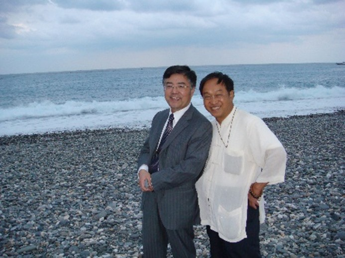

<!--學仁則近仁——我與許學仁教授交往記事--!>

　　物以類聚，人以群分。人固以聲氣相近者相求，漸進於相處而相惜。我與學仁教授之相識而相交，應該是緣於共同的愛好——嗜書之癖，和共同的經歷——詞典編纂。初識學仁兄，似遠在上世紀末的某次學術會議上，而印象尤其深刻的是，我還在上海辭書出版社時，他曾多次會議結束道經滬上，行李未卸，徑奔出版社，在讀者服務部挑一大堆詞典。在辭書編纂最熱的年代，《辭書研究》極負盛名，是詞典編纂者案頭必備之書。他爲配齊這本雜誌，還讓我和楊蓉蓉爲他尋覓創刊初期的幾期。由於所購上百公斤的書無法隨身攜帶，只得找來一部食堂稱菜用的大秤，將書一箱箱過磅計費，寄往台灣。記得光這郵資，在當時的我看來，已是一筆很大的支出，更何況書價本身。我也有書癖，年輕時喜歡買書而囊中羞澀，竟會不惜力氣幫人家買書寄書來過癮。執役《漢語大詞典》編纂處時，不知爲多少人代買《漢大》郵寄，長年樂此而不疲。看到他這樣瘋狂得有點豪擲的買法，雖然羨慕得有點嫉妒，無形中卻因愛書而縮短了距離。那年頭，我也不敢請他去上檔次的飯店，買完書，約了楊蓉蓉，就在北京西路臨近江寧路上的一家茶餐廳吃飯。學仁兄讀博時已參加詞典編纂，深知其中甘苦，所以交談起來就有很多心得和感慨，這心得和感慨也是我倆二十多年來無數次碰面交談的保留話題。  

　　花蓮是一個令很多到台灣的學者都嚮往的旅遊景點，學仁兄家於斯，教於斯，所以送往迎來，成了他生活的一部分。我2004年11月在台師大開會，他邀我去花蓮。那天乘了三個小時的火車，到花蓮已是中午，他和夫人楊老師到車站來接。午飯後，理當去景點賞玩，但由於我心心念念想一睹他的藏書，所以直奔他家。我想看過他的藏書，很多人——當然首先是我，都會“自慚形穢”的，從學術專業的角度論，可以説你有的他當然有，你知道而沒有的他也有，更有你連書名也不知道但卻非常稀珍重要的書，也赫然在他的書架上，這真叫開眼界！開眼界，那也要睜大眼睛小心移步，因爲稍不留意，就會把身後的書給擠倒。當我看得剛入佳境，他已催著我説再不出去就白來了。我們先來到荷花池喝茶，那園池由一位母親帶著一雙兒女經營。雖然秋已深，荷將敗，但與自然融爲一體的園池極其優雅靜謐，靜謐得連小蟲的細鳴聲都能聽見。他邀約程克雅教授和幾位學生一起，圍坐在原木的長檯旁，喝著泡有荷花的茶，交流清代的學術。記憶中，克雅教授讀書很多，凡你所説，她多能對答。這種悠閒鬆弛的舒心氛圍，絶對是氣急趕場的學術會議上體會不到的。太陽西斜，我們驅車到海邊，走在無際的黑白相間的鵝卵石海灘上，夕照在海水中泛著金光，已而縮小成一個深紅的蛋黃，漸漸西沉。太陽一旦沉沒，帶著一股鹹腥味的涼風隨即習習拂面，讓我這生長在上海卻很少看到海的人又被海風侵蝕了一次。那天晚上，他安排我住在一家民宿，由於一整天的奔波，我沒看幾頁書就睡著了。半夜迷糊醒來，只感覺床在晃動，人朝著腳跟方向有墜落感，迷糊的意識誤認爲是白天太累，轉瞬又睡去。早晨起來他見到我，問昨晚有什麽感覺，我回答太累。他説昨晚地震了！啊，我的天——假如……其實不需要假如，花蓮的地震太頻繁，震一下也不過如此，以致我後來在台灣碰到過十多次地震，也就寵辱不驚了。學仁和克雅帶著我，由雅萍開車，穿越太魯閣，沿途在風景秀麗、地勢險峻處，停車駐足，觀賞峻秀的山崖峭壁，爲我述説當年鑿壁開山的用途和用意。緊張的一天半，花蓮的人情與風景已印在記憶深處。近二十年，我曾多次去花蓮遊玩或講學，無不都是驚動學仁夫婦和克雅教授。  

　　2007年初冬客座台中靜宜，不便繞道臺北再轉花蓮，所以直接乘飛機環飛半個島嶼到花蓮，那次到時也已是午後，他和楊老師等在機場接我。因爲下午他有課，特地請學校同事教務長吳家瑩老師陪我遊玩，吳老師開車又帶我到荷花池，可惜那位母親已去世，靠女兒在維持，所以殘敗的荷花池氣氛有些凝固。回到學校，他也差不多上完課，晚上約了書法家羅浩銓等一起晚餐。學仁兄處處爲人考慮，有時我去花蓮，他怕我住賓館有花費，有一次執意要我住他的另一處新房，我就恭敬不如從命。只是那套房間裏面有供奉的神龕，蠟燭燈終夜不滅，我是極易醒而難睡的人，有這燭燈，便也終夜不息。清晨，確切説是淩晨，我起床出戶，漫步在城市的曦光中，貪婪地吸吮著寧靜而新鮮的空氣。唯一遺憾是，無法裝載這新鮮的空氣帶回繁雜的上海。我細數去花蓮承蒙他款待的事，是想説明，大陸語言文字學界有多少人去過台灣，到了台灣，很少有人不想去花蓮，去了花蓮，幾乎可以説沒有不受到學仁兄款待的。可見想見，這花去了他多少精力和時間！而相對寒暄，他總是兩眉一揚，雙眼一瞇，呵呵一笑，讓你沐浴一次春風。  

　　學仁兄其實很忙很忙，因爲他既刻苦又勤奮，這和他越親近的人感受越深。他從讀博時就忙，一邊讀書，一邊編纂《國語辭典》，任教花蓮教育學院後，教育盡心，系務盡職。由於他處事盡心盡職，爲人寬厚坦誠，以致後來內部有些矛盾的文字、訓詁學會理事長和秘書長，都由他來接任。學會的工作相對是以年份而論，而辭典的工作更是長年累月從不間斷的事。他後來又出任《重編國語詞典修訂本》和修訂《異體字字典》等多部辭典的總纂工作，一個星期往返花蓮--臺北一次。這單程坐車就要兩三個小時，可以説是拖著疲憊的身體在來來回回，到了臺北要打起精神工作，回到花蓮要繼續授課。  
  
  
  
　　2016年，我客座台大，住在溫州街，他來臺北編纂辭典的國家教育研究院就在和平東路，入住在福華教師會館，離我住處很近。所以有時他到了，先到我這兒閒聊。我看他瘦小的形體，拖著一個拉桿箱，背著一個沉甸甸的雙肩包，黝黑的臉上掛著幾絲疲憊。我總和他説，這樣來回實在太累了，一定要注意身體啊。他也是雙眼一瞇，呵呵一笑，説快退休了，也正好來編辭典。但一到研究院，大家討論詞義表音，就沒完沒了，領導又不很懂學術，所以總有些難處之事。幾次跟我説，要卸下這副重擔，但始終還是扛著。  
  
  
  
　　他曾多次邀我爲他屬下的編纂人員談談辭典編纂經驗，並希望我能抽出一天時間參加他們的工作。我雖然談不出什麽經驗，但因爲編過二十多年辭典，總還有些苦和樂的感受，正好人在臺北，住地與研究院也近，就應承下來。那天上午我去參加他們詞頻和反義詞的討論，下午作了一場關於編纂《漢語大詞典》經歷和體會的報告。他做事總是禮數周到，結束時還約請研究院領導來給我頒了一個什麽紀念品。本來那天約好晚上要請李添富和李鵑娟兩位教授一起吃飯。後來學仁説先去萬卷樓看看書，就與總經理梁錦興老先生打了電話，梁老一聽我在，便邀約晚上吃飯，這樣就只能從命梁老。梁老約了張晏瑞副總，在家園小館小酌。他雖然年過八十，但豪興不減，晏瑞則記聞博洽，處事精明。席間，我接到唐山書店電話，説我預訂的芮逸夫《中國民族及其文化論稿》到了，可以去取書。我一聽樂壞了，散席後，趁著酒興，立即和學仁直奔唐山，並和他説：芮的《文化論稿》，九十年代初寫《避諱起源》時，是到上海圖書館去複印的，那時港臺書複印要一元一張。後來克雅教授知道我喜歡這書，就去複印了一套送我，我一直視若珍寶。某天去唐山買書，看到有人從櫥頂上取下一套塵封已久的《論稿》翻看，幾十年前倖存的書，居然被捷足者先登了，我知道不會有第二套，就跟在那人後面，希冀他或許回心轉念，臨走時丟下來。這樣足足磨蹭約一小時，他還在不斷尋覓所要的書，我則已沒有心思仔細看書，只是密切注意他的舉動。最後那人絲毫沒有猶豫，輕鬆付款走人。我失落之餘，弱弱地問營業員説還會有嗎？營業員是台大的工讀生，説可以去倉庫找找，於是不抱希望地簽了訂單，實在想不到竟然天從人願，而且那書還是打七折賣給我的，三大冊只要一千三四百台幣。他分享了我的喜悅，眼睛一瞇，呵呵一笑。提著書同路回來，他去福華，我回宿舍。  
  
  
  
　　學仁兄最讓我磬折和崇敬的一點，是他對老師的尊敬。我們的交談，詞典之外，大概就數談他的老師爲多，因爲他的老師李殿魁和許錟輝前輩也都編過詞典。以致他畢業數十年，自己也當了教授系主任，教務繁忙，仍然是老師有事必往。學仁與我談兩位老師，也是有因緣的，李、許兩位都與上海有牽連。要知道，去台灣的老一輩，後來一直很少聽到“謝謝儂”、“白相相”這樣的鄉音。而今老去，行動不便，看到有人從上海來，鄉音入耳，不免興奮。就像台大早年教授《莊子》、年過九十的金嘉錫前輩，看到我就用上海閒話對談，説自己很想回上海看看，但女兒不讓他去——年近九十，誰敢讓你遠走高飛啊？邊説邊笑，快樂的心情掛在魚尾上。李殿魁老師可是有來頭的，據説他是上海四大公司新新公司的小開，用今天的話説就是富二代。但這位富二代不知怎的，不走尋常路，建國前後，輾轉香港，到達高雄，開啟了自己艱苦的讀書歷程，最後創出一條自己的路，成爲著名教授，教書育人，並長期參與詞典編纂。上世紀末兩岸開放交流往來，但人物俱殊，縱使還鄉，也已舉目無親，所以特想和上海人聊。老去之後，孤獨寡言，一度患上自閉症，儘管師母鄭向恆百般逗引，仍然金口難開。學仁兄也是爲老師急，多次叫我去他家和他用上海閒話聊家常。他家住大坪林附近，我去一般就在附近的蘇杭小館相敘。2016年3月，我和學仁去小館，他仍是坐著笑笑，活是一尊菩薩，任你百般勸説，就是不開口。後來學仁説：“老師，您如果唱幾句，虞先生會唱一曲評彈給您聽。”不知是不是老人童年在上海愛聽評彈的緣故，他竟然破天荒地唱了幾句。大家很高興，我們當然不能騙老人，所以我也完整唱了一曲蔣調《杜十娘》。那天老人非常高興，還合了影。三年後，我在桃園中大，學仁又將合影發過來，後面附了一張兩老夫妻的合影近照，微信説：“上一張照片是萬里兄和老師在新店蘇杭小館時拍下。下一幀照片則是上週五下午到教育部開會，在天成大飯店旁的7－11買飯糰果腹，走出店門，巧遇到商家買旺報的老師和師母，原來他們剛到天成飯店和友人餐敘，便坐下來陪老師吃優格，閒聊幾句。老師心情愉悅，順手拍下留影，給吾兄存念。”  
  
　　疫情初起，各自裹足不出。我們聊起買書，他感歎“這年頭的書只能擺闊，真正的讀書人那能買得了？愛書如命的任之師藏書，近日也將委由裡仁書店網路拍賣，想來心痛。”任之乃李老師表德，我就問其近況，他説：“身體還行，精神亦佳，最近搬到中和景安捷運站附近有電梯的公寓，上下樓較方便，明歲米壽。前日跌了一跤，幸好只縫了幾針。”可以看出，老師的起居他事事關心，且時時以老師的憂樂爲憂樂。我想今年老人該是過九十了，可惜今後再也沒有這樣的學生來分擔他的憂愁，分享他的快樂了，思之未免心酸。  
  
　　他對許錟輝老師也是執禮甚恭，言必稱“老師”而不帶姓。對老師的學術成就，更是揚譽不遺餘力；凡老師所命，必盡力去完成，學會理事長等事，都是如此。今年一月，我看到台灣花木蘭出版社《中國語言文字研究輯刊》的主編已經署了他的名，就微信問他，他説“先生之託，不敢推辭”。許錟輝老師小時候也住過上海，兩岸通航後，他和蔡信發老師曾特地到上海的弄堂裏去尋覓舊時的印象記憶，還專就老人探問。所以，在台灣多次開會吃飯時，總坐在一起聊上幾句。許老師學問之精純，爲台灣學界所公認，他的幾本先秦文獻和《説文》引《尚書》之類重要著作我都既複印又購藏了。許老師爲學嚴謹，爲人謙抑，榮休後一直執教東吳。記得有一次我去東吳講座，他竟然也來聽講，嚇得我舌頭撟而不下。我平時去台灣或與學仁聊，總會問起許老師身體狀況，曾聞説八十以後身體狀況急劇下滑。及其仙逝，學仁轉知，謂“有一事轉知，業師許錟輝先生去歲以來急劇衰退，前日（六月一日）上午七時辦天不假年，辭別塵世……預定二十日家祭，並印製紀念哀思專冊，如先生有輓聯、題詞，自當錄入存念，以記因緣”云云，我就叫他把許老師的行歷發來。但那幾天我正在六十歲學吹打，參加駕照考試，隔天去復旦參加周振鶴教授的博士答辯，又隔兩天我自己的博士生畢業答辯，旋又準備去香港中大主持博士答辯和講座，外加一連串審稿、推薦等雜事，可謂馬不停蹄，心靜不下來，故最終沒能擬出一聯一辭，很讓學仁兄失望。我中心愧疚，無法名狀，逝者長寧，浮生忙碌，也無法特地去解釋。所以前天驚聞噩耗，雖然手頭正在策劃馬一浮先生140週年展覽，起草文稿等等，頭緒繁多，我仍然擠出時間捕捉記憶片段，形諸文字，以代弔唁，也希冀學仁兄可以在許老師面前代爲致歉請罪。  
  
　　對老師執禮恭敬，教學生誘導耐心，待朋友禮數周到，這是學仁處世的常態。但他也有金剛怒目的一面，比如對學校的事務、教育的方法等，常常敢冒衆人之大不韙而直抒己見，而且説的時候，表情嚴肅，不假辭色。他數次跟我説起對學校某些做法的意見，聲音鏗鏘，如對當事之人，讓我恍然有受訓的感覺。凡他認爲有理有據，該做不該做的事，都會正辭相爭，甚至不惜以辭職來堅持和維護自己的主張。記得他給我看過用很典雅的文言寫就的辭呈，我在讚歎文體措辭之餘，也略過一絲在錯綜複雜的人際中能否不顧一切直道而行的憂慮。事實上，他也確實因此而遭受到許多不快與不公。  
  
　　台灣的《異體字字典》是一部搜羅很齊全很實用的字典，它就像大陸所編的《漢語大詞典》和《漢語大字典》，凝聚著一批優秀學者一二十年的心血，都是最後一批用手工加卡片編纂的詞典。《字典》編纂者如主任李鍌和副主任陳新雄、李殿魁三位前輩，還包括十多位編委，很多都是我熟識的師長和朋友。但我知道，就中堅持到最後，並不斷參與修訂的應該是學仁和添富兄等少數幾位。之後他又與添富兄一起出任重編《國語辭典》等五部詞典的正副總編輯。學仁一手楷字獨特而漂亮，非常適合於抄寫辭書。他曾告訴我《異體字字典》中的諸多異體字形是他手寫的。我們知道，異體字字形往往奇形怪狀，疊床架屋，筆畫繁多，他卻能把它寫得四平八穩。後來我在雅舍二手書店看到《常用國字標準字體表》《次常用國字標準字體表》，一眼就看出是他的筆跡，買了下來。那天和他一起從唐山書店出來，我就説我買過那書，以後要在講詞典學時專門講一講他對字典和漢字書寫標準的貢獻，他聽了也是呵呵一笑。學仁的學位元論文是楚文字和戰國古文研究，在古文字學尤其是戰國文字學領域的成就播譽衆口。但我在想，當前戰國文字的研究日新月異，將來書寫研究史，固應提到他，而電腦已經完全刷新了詞典編纂的手工操作形態，將來不再需要用人來手寫漢字字形，所以他留在《異體字字典》和《字體表》等辭書上的筆跡將是詞典史上不可忽略的一抹晚霞，恕我不恭敬地以他老師的名諱來形容，他無愧是詞典史上電腦替代手工前夜的“殿魁”。  
  
  
  
　　學仁兄藏書之多，多到原住房實在放不下，只好在旁邊違章搭建以儲。搭建的棚總不牢靠，下雨漏水，地震倒塌，頗多後患。所以我一聽到花蓮地震，就會微信或電話和他聯繫，詢問“傷書乎？不問人”——其實人是不會有危險的。後來有一位去國外的朋友把自己的房子借給他放書，有了這個用“武”之地，他的大部分藏書才有了一個雄偉展示的機會。有一次我去花蓮，他急切切地邀我去看，以顯擺他的“王將軍之武庫”。一排排像圖書館書架的書，有一個與圖書館絶然相反的面目。一般圖書館的書，爲了貼登記的標籤，多把環套拆掉，裸露展示，以防標籤脫落。他的圖書館則反是，幾乎一律地用白紙包起來，就像我們小學讀書時包書一樣。我年輕時買書，也用牛皮紙包，後來書多了，根本顧不過來，也就各隨其面目了。更讓我肅然起敬的是，所有的書包上書皮，都用他極其漂亮的硬楷體字寫上書名和作者，一筆不苟。記得我大概複印過二三萬頁的台灣學術書，裝訂後也用小楷寫上書名，但寫到後來神疲眼倦，就潦草不規矩了。而他則千篇一律，少有遺漏。我邊看就在邊想，我的精神遠不如學仁兄專注。因爲他的書無法識記書的封面，我只能用手機拍攝下來，存在電腦裡，不時翻看。我以前有林慶彰、董忠司等多位大教授來大陸買書豪舉的印象，包括他在辭書社買書闊綽的情景，想當然地認爲台灣學者薪水高，買書還是不存問題，不比我們窮措大的酸態。後來王鍔兄爲我作訪談，談到買書，我説當年爲了便宜，是專淘舊書汙損書零本書，吐了一肚子酸水苦水。他在網上看到了，對我深表同情。我就以他當年買書闊綽來自嘲反襯，他回覆説：  
  
　　萬里兄説笑了，其實我也有好長時間在牯嶺街舊書舖踅摸，偶爾也找到想讀的書。大學時靠編辭書，月入六百大洋，一張飯票一百五十，交通費一百五十，剩下的積存當學費，卻向有錢的學姊借了一千兩百元，買了明倫版翻印中華書局的《全唐詩》，不是瘋子，就是書癡。那時大學一學期註冊費才三千五百元左右，我吃一餐，只花三塊五毛。現在面對你們出版的圖書書價，換我常望書興歎，下不了手。連孔夫子都待價而估，難怪內人常説把書賣了，換成養老金吧！  
  
　　這所謂的大洋當然是指台幣。又説：“印象所及，1981年前後在中國文化學院（中國文化大學前身）擔任講師時月薪似乎在14000NT左右；1984年轉任花蓮師範專科學校（花蓮師範學院前身），因屬公立大學，講師月薪約爲19000NT。”這樣折算下來，遠非我以前所想像得那麽富裕了。後來他説他妹妹還保留著當年的工資數目，發給我看看：1977年，2100NT；1982年，3600NT；1984－1986年，  5700－6300NT；1986年，7500NT；1988年，8400NT；1989年，9000NT；1990年，12600NT；1992年，15000NT；1994年，16500NT；1995年，17400NT；1996年，18300NT；1997－1999年，20100NT。這個水準當然低於大學教師的薪水。台灣的薪水高，但書價也高，很難想像他擁有這樣一座圖書館，傾注了多少心血，花去了多少人力物力！我時常沉思，當年這麽瘋狂買書，絶對想不到幾十年之後會被電子文本一下子吞沒，變得雖不是一文不值也接近無足輕重。現在你要想捐贈，還要看圖書館的臉色，聽從他們的頤指氣使。我多次玩笑和他説這事，他始終不接話題。我知道他真心愛書，誰願意看到、想到自己數十年含辛茹苦，像燕子一樣銜泥含草築的屋，一旦傾覆他屬呢？這裡面有多少次想花上個十元八元吃一頓美餐，卻硬生生抑制食慾，壓抑自己去完成一次例行的充飢模式；這裡面有多少個夜晚瞌睡難熬，卻強打精神，努力爲多寫一個詞條，多抄一頁字表（他曾告訴我當年抄寫《異體字表》是一毛錢一字），去換錢到舊書店淘自己喜歡的書。行筆至此，我甚至在想，他彌留之際，是否考慮過這些書的歸宿。但我衷心希望絶對不要散失，這不僅僅因爲這是他數十年凝聚心血的結晶，更是這些藏書足以建立一個非常齊全的戰國文字研究所圖書館！果能如願，既可造福後來的學者，也差可告慰爲書辛苦爲書忙——忙了一輩子的學仁兄。  
  
  
  
　　我們最後一次相見是2019年4月8日，那天是在臺北參加福建師大在萬卷樓出版的《百年學術論叢》第四輯發佈會，因爲與會人多，也沒多交談。散會後他回花蓮，我回桃園中壢。在各自的火車上還發微信聊天。他説最好19日（星期五）他來臺北時我能北上，他想請朱歧祥、李淑萍等教授一起聚餐。聞知那天歧祥兄有事不能來，我説那就再等下次吧，不爭一朝。五月回滬，我當然想著不久還會去。哪知疫情一來，從此天涯阻隔，只能微信互傳。台灣疫情上升期間，正大陸接二連三接種疫苗時。我問他疫苗打了沒，如果可以來滬一遊，伸臂可種。他回答説：“謝謝關心和盛情。因爲這個節骨眼，我太年輕，AZ、莫德輪不到我打。等到BNT進來，我又太老，也輪不到我。中小學教師先打，因大學教授會遠距教學，更輪不到我，何況我還只是退休的榮譽教授，根本輪不到我，只能自求多福，一笑。還好我和內人宅在家裡，擦書、授課、開會、用餐、休息，哪都不去，降低感染機會。加上二個半月前，罹患帶狀皰疹，與疼痛爲伍，幸好正緩慢康復中。不知蓉蓉大姐可好，煩代致意。”這當然是真實的玩笑，所以我也戲言説：“馮唐易老，李廣難封，學仁而竟逢“不仁之政”，豈不哀哉！？”聽到他患上疼得要命的帶狀孢疹，我感同身受。記得我患此病時，適值他在復旦參訪，遂和他夫人來我家傳授治療經驗，所以我立即撥通電話和他聊了一陣，以示安慰。2021年夏，他公子庭瑋來滬，我問是要來家裡，還是學校。因爲他微信説兒子是台灣交通大學統計研究所畢業，要想到上海交大來看看，並問起犬子音南在何處就職。我一看笑了，音南剛巧入職上海東華大學。他執教東華，兒子就讀交大，我執教交大，兒子入職東華，也是相映成趣的一樁生活瑣事。不過那時我正將從交大離職，所以趕快請庭瑋來參觀一下，在學校對面聚鑫閣午餐並留影，傳給學仁，他再三微信致意。  
  
　　今年2月14日，他學生微信我，説他年前中風，所幸意識清楚，語言能力無礙，唯半身表情、動作較不方便，正在慈濟醫院康復。楊老師叫他告復同仁，免得人牽掛。我收到微信，立即撥其電話，久未接聽，如是而三，再轉撥楊老師電話，也不接。過幾天又打，仍未接通。由此在工作、讀書、寫作時不斷想起，意識流時而流向光明，心寬鬆一點；時而流向陰暗，絃繃緊一下。但即使流向陰暗，最壞也只想到半身不遂之類，因爲説他意識還是清晰的。及至人二兄轉來微信，心一緊，頃刻沉入深淵……  
  
　　古往今來，父母生子，肇錫嘉名，總希望長大後有所成就成德。況且人生一世，其名字被人呼喚，何啻千萬！千呼萬喚，對一個積極向上的人，無疑有很大的激勵和潛移默化作用！想到他父母爲取名“學仁”，寄意亦可謂遙深。儘管夫子説：“若聖與仁，則吾豈敢？”但在深表惶恐之餘，仍轉折回來説：“抑或爲之不厭，誨人不倦，則可謂雲而已矣。”想想學仁兄數十年中對學問之不懈追求，對師長之執禮終生，對學生之盡心作育，對事務之克盡職守，亦可謂雲而已矣。於今再來回憶他的音容笑貌，謙然若不欲與人爭，看似木訥；而於某些行政教育之決斷與詞典編纂之方法，一旦認準一理，峻介嚴詞，果敢而行，大有雖千萬人，吾往矣之勢，顯示出其剛毅的一面。夫子又説“剛毅木訥近乎仁”，豈非學仁兄之謂乎？近仁原於學仁，學仁而得近仁，兄之一生，亦可謂以之似之矣。  
  
　　聞悉今日爲學仁兄家奠告別儀式，家屬師友盡往執紼送行，我以一水橫枕，陰陽兩隔，遙望南天，謹以默意傷辭，焚香拜祭！  
  
  2023年5月13日至20日於馬一浮書院