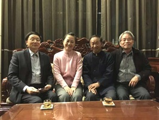
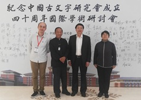

<!--懷念許學仁先生——回憶難忘的一段交往--!>

　　我得知許學仁先生於2023年5月12日下午去世的噩耗，是洪德榮博士於許先生去世的當晚告訴我的。我不敢相信並一再確認。德榮博士微信告訴我：“許學仁老師於今日下午仙逝。今年過年前起夜中風後，許老師便一直在醫院，中途又新冠確診，對他的健康都是很大的打擊，身體的狀態一直都不太樂觀，肢體、意識等狀態都不好。”仁兄去世，令我震驚、悲痛！我立即回復：“我的好兄弟學仁，真沒想到突然就這樣走了......請轉達我對其夫人及子女的問候，望家人節哀順變”。13日，我將在網上看到的有關悼念學仁先生去世的資訊發至大陸“2022古文字年會”微信群，兩岸學者紛紛表達悼念之情......  
  
　　學仁先生出生於1952年12月28日（小我兩歲），壽齡沒有達到當今中國人的平均數77.3歲，可謂英年早逝，可惜可歎！他的去世，是學術界的重大損失，也使我失去相識多年的好朋友、好兄弟。悲痛之餘，不由得回憶起我們之間令人難忘的一段交往。  
  
　　那是1998年12月至臺北參加由國立師範大學承辦的“第四屆中國訓詁學學術研討會”期間。這次受邀參會的大陸學者，主要由我聯絡各方統一辦理有關手續，記得有郭錫良、李家浩、李解民、李建國、孫雍長、任繼昉、王雲路等先生。會前，學仁先生得知我參會的消息，11月26日親自打來電話，擬會後請我至其執教的花蓮師院做一次學術演講，並請我提供個人簡歷及演講題目以便利用，使我很受感動。  
  
　　12月5日，研討會如期開幕，學術報告、討論進展順利。晚上，學仁先生特意約我與任繼昉先生去看望他的老師李殿魁先生，很是高興。李先生很隨和，學識淵博，我們受到熱情接待，並相互交談各種問題。最難忘的是，李先生的藏書就像圖書館，令我們大開眼界。  
  
　　12月6日下午討論結束後，學仁先生便約我至機場乘飛機趕往花蓮。到花蓮後，先至其府上稍息。學仁先生特別邀請花蓮師院教育系主任吳家瑩先生陪坐，並請吳先生送我至校招待所住下。  
  
　　12月7日上午，學仁先生陪同，由其學生羅浩銓先生開車，至太魯閣公園參觀。我們看了影視介紹後上山，不巧，因修路難以前行，只好折返至另一處風景點。此景點風光也不錯，尤其是燕子嘴一帶很險峻。中午在附近酒店用餐，景美小學校長古月恆先生做東。下午由我演講《曾侯乙墓發掘與曾楚文化關係》。因為我親自參與主持了此墓的發掘，有一些切身體會，同學們很感興趣，紛紛提問並搶著與我合影留念。晚上，系主任徐泉聲教授宴請，許學仁、黃靜吟、羅浩銓諸位作陪。宴後，學仁先生又帶我們至古拙廳品茶。該茶廳真是名不虛傳，陳列古拙精緻，別有情趣。  
  
　　12月8日，原定下午去臺南，因無飛機便取消這一行程。由學仁先生陪同，羅浩銓先生開車至東海沿線看看。許一路介紹臺北方言、土著等情況，記憶猶新。中午在一家酒店用餐，下午返回。晚上，許先生安排在檜木館為我回請大家，應邀者有徐泉聲主任、吳家瑩夫婦，古月恆校長、羅浩銓先生、魏嘉萱女士。餐後至吳先生府上小坐。記得吳江小學校長陳建明先生從90裡外地趕來相見，令人感動。  
  
　　12月9日早上，吳家瑩先生送我至機場，許先生也來了。不巧，飛機因故未從臺中出發，要等。許先生先趕回學校上課，我在機場等候；徐主任的太太在機場工作，得知情況後幫我瞭解飛機起飛信息並陪同用茶。許先生下課後又趕來機場。大約10點50分左右飛機起飛，往臺中。後從臺中回到臺北，受到林清源、鍾柏生、蔡哲茂、季旭昇等先生的接待並安排講座。13日回京。  
  
　　此次赴臺雖然時間不長，得到多方面及學者的熱情接待與安排，頗有“兩岸一家親”的真摯感受。尤其是學仁先生於百忙中的細心安排，令人難忘。  
  
　　此後我與學仁先生常有溝通。他若有活動來京總是告訴我，還每每帶來一盒臺灣茶葉，我也以薄禮回敬。有一次得知許先生夫人楊麗圭女士來京，我攜夫人專程前往下榻賓館看望，並熱情招待。  
  
　　2018年10月9日-11日，我們一同參加於長春南湖舉行的“紀念中國古文字研究會成立四十週年國際學術研討會”。11日晚，古文字學家何琳儀先生的女兒何姍姍由羅小華博士陪同來看望我，我便領她去拜見了其父親身前的臺灣好友許學仁和季旭昇先生。何姍姍約請我們一同至另一大樓品茶，相互深情地回憶大家與何琳儀先生交往的往事，並合影留念。  
  
　　新冠疫情肆虐前夕，許先生來京，我與夫人專門約請在北京長椿街地鐵站南面的陳阿婆酒店聚會，相談甚歡，並合影留念。遺憾的是，此次合影因手機遇到故障未能保存下來。沒想到此次見面竟成為永別......  
  
　　許學仁先生專精於文字學、訓詁學、古文字學等方面的教學與研究，主持或參與主持有多部字典、辭書等編纂，成就顯著；其學問功底深厚，桃李天下，為人謙和，待人真誠。他雖然離開了我們，但其學術成就、學人風範及與大家建立的深厚情誼，將永遠銘刻在人們心中。  
  
  2023年7月記述於北京
  
  

  <figure class="text-center">
    

      
    

    <figcaption class="mt-2 text-sm text-gray-600">右起：季旭昇 許學仁 何姍姍 黃錫全（2018.10.11）</figcaption>
  </figure>
  <figure class="text-center">
    

      
    

    <figcaption class="mt-2 text-sm text-gray-600">左起：洪德榮 許學仁 黃錫全 劉風華（2018.10.10）</figcaption>
  </figure>

