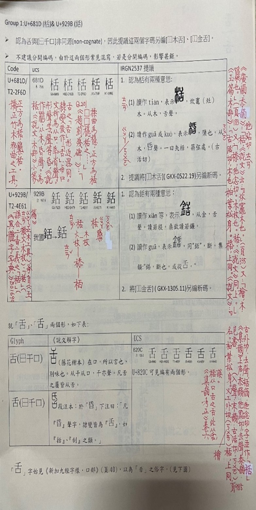
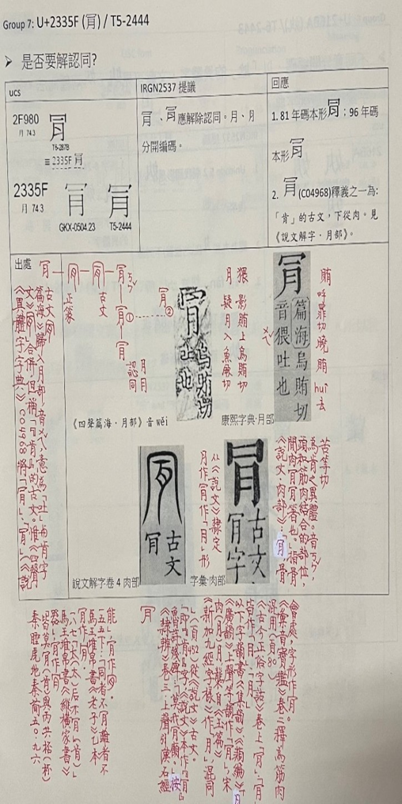

<!--學仁老師與中推會——因文字結緣，也因文字續緣--!>

<b>因文字結緣</b>
　　財團法人中文數位化技術推廣基金會(簡稱中推會)與許學仁老師的緣分應從約20幾年前說起；2000年代初，中推會接手代表我國參與國際組織的漢字編碼相關業務，除了我們使用的漢字外，本會也希望能將古漢字編入國際標準，將中國文化有脈絡的於元宇宙中串接。最初從甲骨文著手，並在李鍌老師推薦下，有幸與學仁老師一同展開了長達近十年的整理、討論工作。2014年前後，中推會另啟動《說文》小篆的數位化的編碼標準計畫；迄今已9年的時光，感謝學仁老師無私解惑，任何時刻總是不厭其煩的為我們釋疑，成為本計畫的最強力後盾。此計畫正值開花結果之際，《說文》小篆已正式納入ISO/IEC 10646國際標準，預計今年或明年正式刊印於碼本。遺憾老師未能來得及親見，但本會會在古漢字數位化編碼繼續努力，讓古漢字永續在我們生活之中。  

<b>對文字大愛</b>
　　學仁老師的文字學識淵博，對我們不遺餘力的傾囊相授，舉凡字的標準寫法、文字演變、或是釋義用法等各種疑難問題，無不熟諳，並依其脈絡，諄諄教導。中推會參與國際會議討論中日韓等文字審查，若遇到問題向學仁老師請益時，學仁老師總是不吝解說，甚至幫忙翻查文獻，並慎重的寫下他思慮後的見解(老師手稿如附圖)，讓我們得以更有力回覆其他會員國所提出的問題。一次又一次的解方，從字裡行間，我們感受到老師對於文字的熱忱與大愛。  

<b>對中推會關愛</b>
　　長期以來，中推會承蒙學仁老師的諸多照顧，且不計較我們這些晚輩的諸多提問；在國際會議時，遇到文字學方面問題，有時我們會急忙打電話發問，請老師隨即解說，或是協助查證等。老師總是不疾不徐的替我們解惑，若我們語氣中有任何一絲不確定，還會出聲安撫說：「若是不清楚，我再寫成文字傳給你(們)吧！」謝謝老師您的不藏私、不拒絕、不翻臉，有您的陪伴，讓中推會在文字數位化領域上，才能如此堅定、有信心的努力著。  
  
　　長久以來，您辛苦了，一切病痛皆已過去，一路好走！古漢字數位化仍在進行中，中推會會繼續堅持不懈，而您與中推會的緣分依舊持續著。

  

  <figure class="text-center">
    

      
    

    <figcaption class="mt-2 text-sm text-gray-600">許學仁教授手稿(1)</figcaption>
  </figure>
  <figure class="text-center">
    

      
    

    <figcaption class="mt-2 text-sm text-gray-600">許學仁教授手稿(2)</figcaption>
  </figure>

