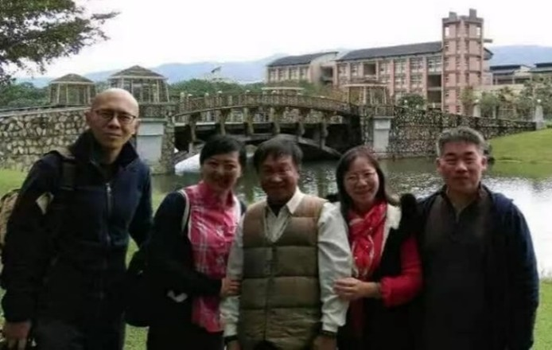

<!--悼許學仁先生（崔雪梅）--!>

　　驚聞許學仁先生去世……心裡疼痛……人生一別，終是沒有機會再見。17年臺灣教學，去到先生工作的東華大學和寒舍小聚。先生的家太簡樸，空蕩到沒有多餘。與之強烈對比的是書屋，擁擠到幾乎落不下腳。一平米的小座椅，先生坐在其間也看不見身影，只有精神在宏大的世界裡奔跑。對物欲的克制、淡泊以及先生身上獨有的晉人風骨，可謂真正的知識份子！先生帶我們去洄瀾窯拜會臺灣陶藝大師翁念叔，一建盞邊沿不慎碎掉，翁老師將先生的書法二次嵌釉，做了暗色的金繕修復，那份拙雅，很有古意。先生帶我們去到畫家顏文堂舍，鬥詩繪畫習字，釆菊東籬，唱和南山……回到成都，與先生更多微信交流，教育美學哲學，亦是受益終身。這一年，因為工作瑣碎，與先生聯繫漸少，最終的紀念，定格於22年12月。誰曾想，那年那時作別，終成永遠。先生千古，先生千古，先生千古！ 
   

  <figure class="text-center">
    

      
    

  </figure>
  <figure class="text-center">
    

      
    

  </figure>
  <figure class="text-center">
    

      
    

  </figure>
  <figure class="text-center">
    

      
    

  </figure>

