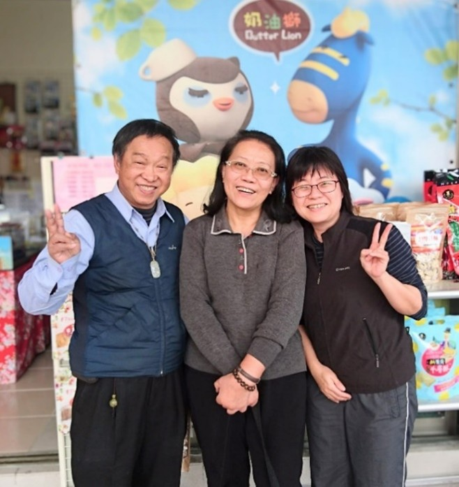

<!--感恩許學仁老師(曾珮瑜)--!>

　　五年前(2018年)2月6日深夜23:50左右，花蓮發生規模6.2有感地震，「統帥大飯店」大樓一、二樓倒塌，「雲門翠堤大樓」嚴重傾斜，而今這兩棟建築物都已不在。當時飲冰室書店位於介壽一街3號，災後，我們在書店整理，2月10日許學仁老師和楊麗圭老師賢伉儷特地來書店看看我們，還買了七包法式雪花酥和杏鮑菇香絲回去，我想老師們那時一定很替我們書店擔心，所以特地來給我們打打氣。  
  
　　去年11月12日晚上去老師家，許老師那時精神還不錯，仍很健談，我要離開他們家的時候，楊老師還送了有機山藥給我，讓我帶回來給媽媽料理。  
  
　　今年3月30日，我陪老公到醫院回診，在醫院入口處遇到楊老師，我趁著空檔到病房探望許老師，因為許老師在休息，所以沒跟許老師說上話。  
  
　　早在2004年2月（那時小兒子鈞鈞才剛滿月，而今已經是大一的學生了），飲冰室書店還在博愛街154號的時候，許學仁老師和楊麗圭老師就經常到書店來買書，即便我們書店搬了這麼多次，不管我們在介壽一街還是府前路或是現在的民權路，老師們對我們的關心依舊不變。  
  
　　許學仁老師國學底子深厚，過去也經常在曾國城先生主持的「一字千金」的節目為大家解惑，記得小兒子某次在外公家看電視,還特地打電話到書店給我:「媽媽， 那個常常來書店的許學仁老師， 現在出現在“一字千金”的節目裡，他是評審耶！」  

 

　　那天(2018年2月10日)，許老師跟我們說：「朋友有時間就見見面、吃吃飯，因為每吃一次,就少一次！」言猶在耳，今早，小妹傳來網路新聞的訊息給我，我才知道許老師昨天往生了，雖說人終究會離開，但學富五車的許老師平易近人的模樣，還有近20年的陪伴和鼓勵，永遠會留在我們心中！只希望最愛許老師的楊麗圭老師也能多保重身體！