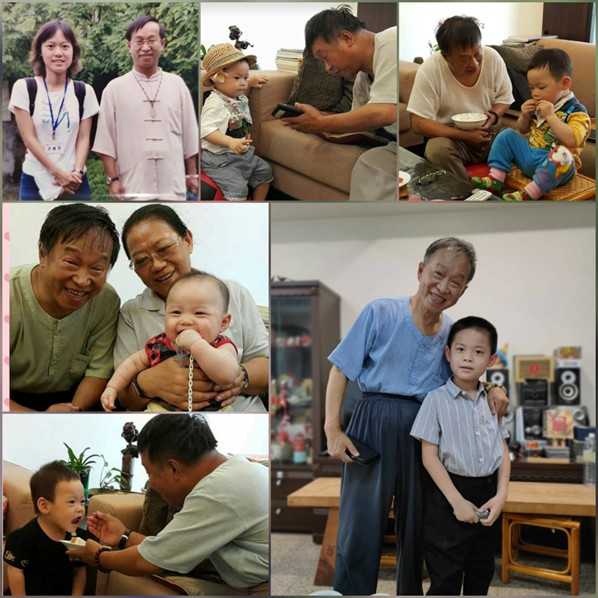

<!--記我如父般的恩師--!>

　　我如父般的恩師，寶少爺常常叨念的學仁阿公，感謝您26年來對我的教導還有照顧，您跟師母總是給我在花蓮生活安定的力量，有任何疑難雜症找您跟師母，你們總是像我的父母一樣，給予我們最大的幫助跟支持。  
  
　　寶少爺更是從小就愛到您家裡蹭吃蹭喝，你們也總是對他無比寵溺，每次到家裡，您跟師母就像阿公阿嬤覺得孫子永遠吃不飽般的，一直拿各種食物餵食他。有一次少爺去逛您的書庫，還把您的藏書撕破，您也只是哈哈笑了2聲帶過，等他大些了，您開始跟他說一些小故事，問他語詞的意思，不厭其煩的引導他思考文句字詞用法，還說以後要教他寫字，似乎我沒好好學習的地方，都刻意讓少爺學好學滿，上次森宇去看您，您還答應他要快快好起來，再一起散步吃飯，最近他老是問我，為何我去找您都不帶他了，我都回答他，學仁阿公很快就會康復了，以後去家裡找他吃飯聊天，不要到醫院。  
  
　　現在您終於離開醫院，遠離病痛了，我知道要祝福您，但心裡還是有更多的不捨與悲傷，今晚森宇跟我一直找跟您的合照，森宇看著照片對我說以後想您，我們可以一起看照片，學仁阿公現在去天堂了，不要再流淚了。  
  
　　謝謝學仁老師跟麗圭師母對森宇的疼愛。

 
