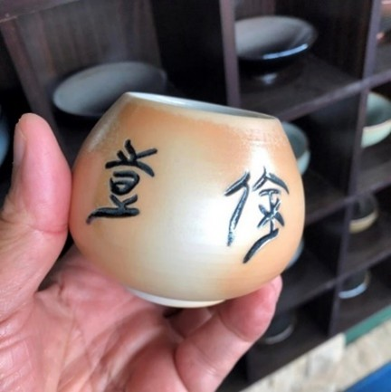
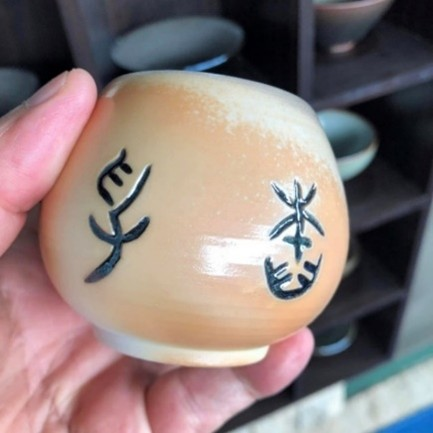
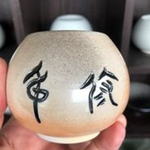
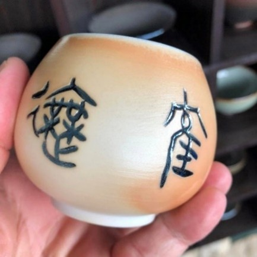
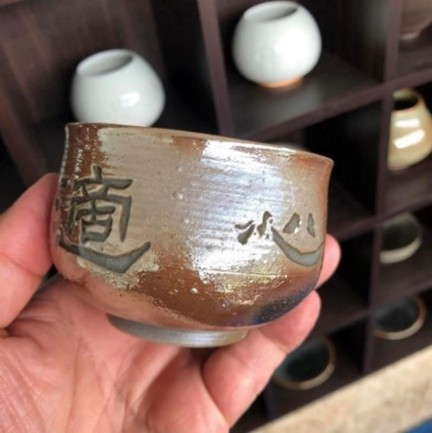
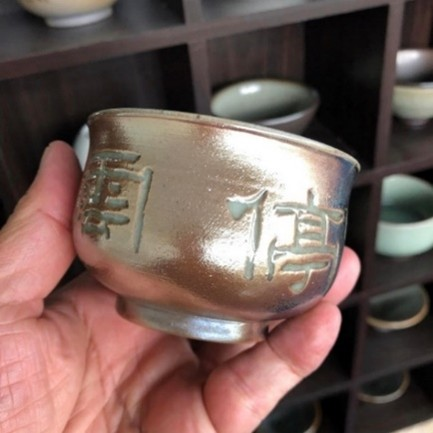
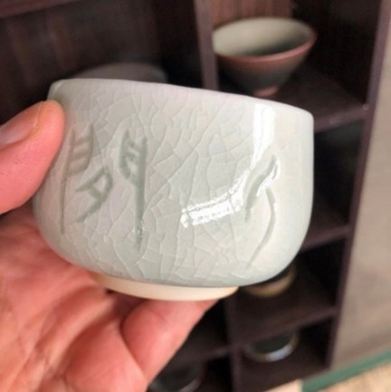
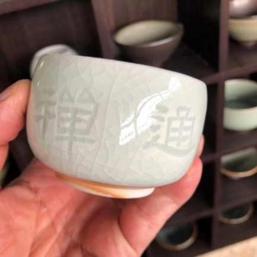

<!--老師，我想您了--!>

　　我敬愛的許學仁老師在昨天永遠離開我們了！從半年前因為中風而住院治療，期間病況時好時壞，而在昨天下午，經由學妹玉玲傳來令人扼腕痛心的消息：許老師走了！  
  
　　還記得上個月，好友雲鳳傳訊息給我，說希望我寫一篇和老師有關的文章，她匯集了之後，會送到醫院讓師母唸給老師聽，希望大家為老師集氣、加油！  
  
　　我當下立馬就答應了雲鳳我會寫，只是之後因為臺北擺攤和燒窯行程，讓我遲遲沒有動筆，怎知今天提筆，竟是要和老師說再見？  
  
　　從昨晚到剛剛，臉書上不斷出現一些老師的好友和學生紀念和感謝的文章，這讓我也忍不住想說一說我認識的許學仁老師。  
  
　　嚴格來說，我並沒有上過老師的課，雖然我是花蓮師專畢業，但是老師是在我專五那年才進入花師教國文。如果沒記錯，他教甲班，而我在乙班，加上我不是語文組，所以緣淺福薄，讀書期間只知道有這位老師，甚至連交談都不曾有過。  
  
　　真正開始和老師有交流，是在我28歲那年，擔任國小國語科課程標準委員的時候，當時巡迴全省的說明會來到花蓮，與花師語文組教授有場座談會，會中老師對語文教育的見解讓我十分佩服！  
  
　　之後老師擔任板橋中小學教師研習會國語科實驗課程的編輯委員，而我也因為借調教師研習會，於是漸漸熟稔起來，可真正開始和老師有密切接觸並不是在國語科的課程編輯，而是我辭去教職，來到花蓮蓋了洄瀾窯之後的事。  
  
　　來花蓮這些年，老師對我非常照顧，新冠肺炎疫情之前，我們幾乎每個月都要一起吃個飯，甚至還經常與師母過來洄瀾窯喝茶。我知道老師字寫得好，於是就希望可以和老師合作，由我來拉坯做陶，老師寫字，然後我再篆刻素燒，最後上釉、柴燒。  
  
　　老師一口就答應了，於是前前後後也做了一些，這些和老師合作的作品，大部分我還保留著，除了之前曾經讓藏一些，這幾年的作品，我一件也沒有賣，有朋友想買，我說這是非賣品，因為老師是文字學泰斗，是國寶，國寶當然不能賣！其實，說穿了，只因為這是老師和我共同的記憶，我捨不得啊！  
  
　　老師就這樣沒有說聲再見的走了，住院期間，我曾經兩次到醫院短暫探視，看著老師那曾經自由自在的靈魂，此刻卻被禁錮在一個動彈不得的軀殼裡，我的心好痛啊！可我也只能緊緊握著老師手，在老師的耳邊說：您趕快好起來，我們再一起去吃飯，好嗎？  
  
　　昨天聽到老師逝世消息的當下，內人忍不住痛哭失聲，可不知怎麼的，我卻一滴眼淚也沒有流，直到昨晚老師入我夢來，我夢見和老師一起參加某位朋友的葬禮，老師問我怎麼沒有穿一套正式一點的衣服，於是我急忙趕回家換衣服，可衣服換好了，天空卻開始下起傾盆大雨，然後滾滾泥流，阻斷我與老師之間的道路，我們沒有再見面，甚至連一聲再見都沒有…...  
  
　　夢醒來，我淚濕床頭，我告訴自己，這樣是不行的，所以，今天，我要穿著正式的衣服去看老師，然後為您撚炷香，跟您說再見，跟您說：老師，我想你了，一路好走！

  <figure class="text-center">
    

      
    

  </figure>
  <figure class="text-center">
    

      
    

  </figure>
  <figure class="text-center">
    

      
    

  </figure>
  <figure class="text-center">
    

      
    

  </figure>

  <figure class="text-center">
    

      
    

  </figure>
  <figure class="text-center">
    

      
    

  </figure>
  <figure class="text-center">
    

      
    

  </figure>
  <figure class="text-center">
    

      
    

  </figure>

