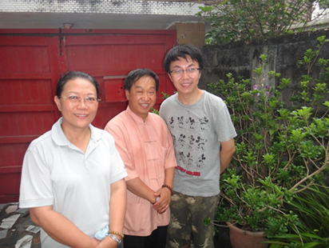

<!--懷念許學仁先生(許可)--!>

　　2023年5月13日傍晚，輔仁大學金周生教授發來許學仁先生仙逝的噩耗，當天我一夜未眠，回憶起這位對我幫助極大的學者，心中久久不能平靜。  
  
　　2012年，我公派赴輔仁大學交換，曾兩次去花蓮拜訪久仰的許先生。當年6月，第二次到花蓮時，先生和師母邀我去他們家居住。除了參訪許先生在東華大學的辦公室以及那著名的書庫外，因本家的緣故，許先生還特地給我看他們供奉的許氏宗親牌位。許先生喜歡玉，那次還抽出時間到花蓮的采玉工廠為我挑選了一塊玉，當場製成玉珮贈我，我將之珍藏至今。那玉底色呈淡粉，中間有猶如山川的深褐色玉沁帶一條，就像花蓮的天空，山海之間總有雲朵飄浮不定。我曾經在東華校園裡，望著天空，對許先生說：“這裏的雲很美！”他說：“這雲你每天來看，都不一樣，看也看不夠。”師母說：“他常年奔波，在台灣從北跑到南，但好像就只跟東部有緣分。”許先生則笑言：“花蓮好啊，你看連雲都這麼好看。”  
  
　　從台灣回到大陸後，我開始準備清華大學的博士生入學考試。因為要跨專業考歷史，且又是最高學府，難度之大，使我心中一直忐忑，但許先生卻不斷鼓勵我。特別是在進入面試階段時，我鬥膽勞煩他為我寫推薦信，他欣然應允，親自手書並以航空件寄來。收信的教務老師拿著信封說：“這字寫得也太好看了，我都捨不得拆了！”我想，那可是手摹《異體字字典》字形的許先生啊！多年後，我有幸得到一本許先生的碩士學位論文《先秦楚文字研究》。兩百多頁的正文、文字編、附錄，包括大量古文字形和圖表，全部為許先生手寫完成。尤其文中繪有安徽、河南、湖北、湖南等省出土楚國銅器圖，地圖上山水湖泊清晰，出土地點明顯，皆是許先生手繪。整本論文，僅從書寫角度就已經是一部藝術品！足見怹對寫字的癡迷和認真。  
  
　　十年多以來，我在臺北、台中、北京、上海等多處見到許先生。或是在學術研討會上向他請教楚簡文字的問題，或是在首師大聽他與季旭昇先生的演講。就像十年前在花蓮他要把很多電子資料都拷給我一樣，在這些學術場合，怹對我的幫助都依舊慷慨無私。2017年，許先生在復旦大學講學，剛剛入職華東師大的我登門拜訪，怹特別囑咐我，從事學術工作和做學生不一樣了，要盡快適應新的職業生活。  
  
　　許先生樂於接受新事物，怹除了會以網絡哏逗笑年輕學生，還很早便使用微信。因此，這些年在年節時用微信向怹和師母問安，便成為了我的習慣。2022年9月，中秋節後不久，台東發生地震，我旋即在微信上問候怹。許先生也很快回復一切平順。2023年過年期間，聽聞他住院的消息，我便沒有向怹拜年，只能拜託巫俊勳老師代為問候，還想著下半年或許會有機會去台灣看望怹。之後還一度聽到怹病情有所好轉的消息，所以當噩耗傳來時，我震驚、悵惘不已。  
  
　　怹在楚文字材料並不多見的年代開始研究楚文字，並一直將此持續四十餘年。怹持續多年獎掖後進，以樂觀、積極的態度影響了無數學子。多年來，怹和師母幫助過的兩岸學人數不勝數。在兩岸文化教育交流上，怹做出了莫大的貢獻。  
  
　　眾所周知，許先生一生愛字、愛書、愛玉，怹就和其筆下的字一樣端正、和怹收藏的書一樣廣博、和怹撫摸過的玉一樣溫潤。怹還喜歡花蓮的雲，現在怹也應該在雲上看著我們吧。許先生對我的關懷和助益，我將銘記一生。

