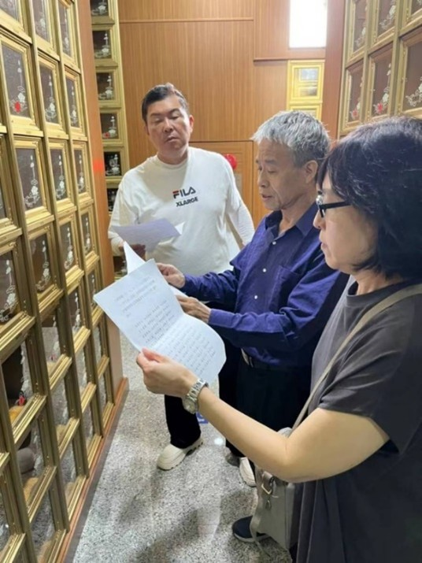
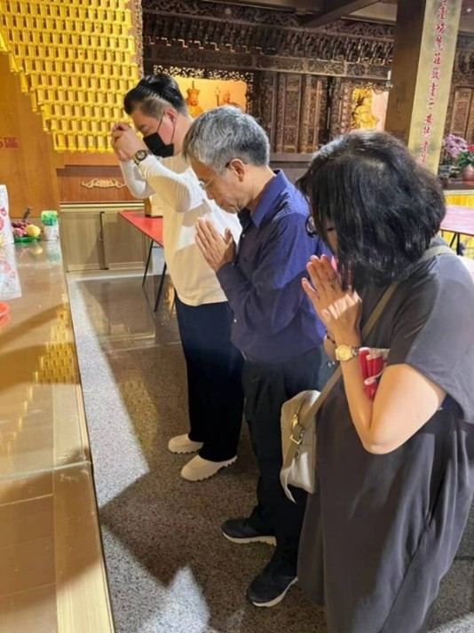

<!--祭文(季旭昇)--!>

中華民國一百一十二年八月三日公共電視台「一字千金」主持人曾國城偕同製作人施珠勵、評審教授季旭昇、陳嘉淩致哀於許學仁教授靈前。辭曰：  

嗟哉許公，如玉如松，源承粵廣，派衍臺東。 
生小家貧，儉學勤工，振羽華岡，師長優容。 
駕策師大，浩淵潛龍，精研楚簡，瀛洲揚名。 
執鞭花蓮，傳道護種，深耕教育，驛馬馳驄。 
身繫五典，發覆解矇，小學不失，大業乃宏。 
國際編碼，用心經營，舌戰重譯，談笑用兵。 
一字千金，攜手國城，析錯解謬，笑語盈盈。 
萬目所視，萬耳齊聽，振聾發聵，響徹金鐘。 
藏書充棟，腹笥滿籯，作育門徒，桃李繁英。 
世風亟變，去中權平，用心如秤，執重若輕， 
說文解字，論道談經，學仁得仁，不忘初衷。 
為人太多，戮力從公，為己太少，羸頓龍鍾。 
天妬斯文，染疫中風，蒼旻不弔，奪我許公， 
敬薦生蒭，目送歸鴻，天喪斯文，吾誰與從。  

